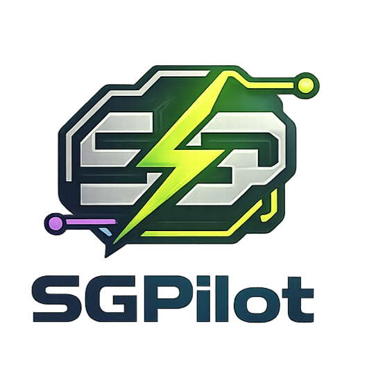

<p align="center">
  
</p>

<h1 align="center">SGPilot</h1>

<p align="center">
  <strong>Automação inteligente de atendimento — SGP (TSMX) + Papervines em um só app.</strong>
</p>

<p align="center">
  
  
  
  
</p>

---

## O que é o SGPilot?

**SGPilot** é uma ferramenta desktop para **Windows** que automatiza tarefas repetitivas de atendimento ao cliente. Ele se conecta ao navegador **Google Chrome** via protocolo DevTools (sem extensões!) e age diretamente nos sistemas **SGP (TSMX)** e **Papervines**, tornando o trabalho dos atendentes muito mais rápido e eficiente.

### Aba SGP — Automação de Ocorrências

- **Hotkeys configuráveis** (F1–F12 e outras) que preenchem formulários de ocorrência com um único toque
- **Leitura automática do número do contrato** diretamente do HTML da página — sem OCR, rápido e preciso
- **Select2 inteligente** — preenche Tipo, Origem e Contrato via JavaScript em uma única chamada
- **Cadastrar + OS** — fluxo completo: preenche a ocorrência → cadastra → seleciona motivo corretiva → cadastra OS, tudo automaticamente
- **Link de pagamento** — fluxo de 2 etapas com colagem instantânea da URL no chat
- **Envio de texto** no chat via clipboard (instantâneo, sem simulação de digitação)

### Aba Papervines — Atendimento em Loop

- **Loop automático** que processa toda a fila de "Novos" clientes sem intervenção manual
- Sequência: clica em Novos → abre o primeiro cliente → clica em Iniciar → digita a saudação → envia → repete
- **Saudação editável** e delay configurável entre cada cliente
- **Log em tempo real** com timestamps para acompanhar cada ação

---

## Capturas de Tela

| SGP (Dark Navy) | Papervines (Light Purple) |
|:---:|:---:|
| Tema escuro com accent verde | Tema claro com accent roxo |

---

## Instalação Rápida

### Pré-requisitos

- **Python 3.10+** com pip instalado
- **Google Chrome** instalado no Windows
- **ChromeDriver** (gerenciado automaticamente pelo Selenium Manager)

### Passo a passo

```bash
# 1. Clone o repositório
git clone https://github.com/vitorstewartglennon30/SGPilot.git
cd SGPilot

# 2. Instale as dependências
pip install -r requirements.txt
```

> 💡 **No Windows:** Execute `instalar.bat` com duplo clique para instalar as dependências automaticamente.

### Executar o SGPilot

```bash
# 3. Inicie o Chrome em modo debug (feche todos os Chrome abertos antes!)
# Execute o arquivo: chrome_debug.bat
# Ou manualmente no Prompt de Comando:
"C:\Program Files\Google\Chrome\Application\chrome.exe" --remote-debugging-port=9222

# 4. Execute o SGPilot
python main.py
```

### Gerar executável `.exe`

```bash
# Execute build.bat ou manualmente:
pip install pyinstaller
pyinstaller --onefile --windowed --name SGPilot --icon sgpilot.ico ^
  --add-data "logo.png;." --add-data "logo2.png;." ^
  --collect-all customtkinter main.py
```

O executável estará em `dist/SGPilot.exe` — pode ser distribuído sem precisar do Python instalado.

---

## Como Usar

1. Feche **todo o Google Chrome** aberto
2. Execute `chrome_debug.bat` para iniciar o Chrome em modo debug
3. Acesse o **SGP** e/ou o **Papervines** normalmente no Chrome
4. Abra o **SGPilot** (`main.py` ou `SGPilot.exe`)
5. Clique em **"Conectar ao Chrome"**
6. Use as **hotkeys** ou o botão **"Iniciar atendimento"** conforme necessário

> 📖 Veja o [Tutorial completo](TUTORIAL.md) para um guia passo a passo com todos os recursos.

---

## Estrutura do Projeto

```
SGPilot/
├── main.py                # Código-fonte principal
├── requirements.txt       # Dependências Python
├── instalar.bat           # Instalador de dependências (Windows)
├── chrome_debug.bat       # Inicia o Chrome em modo debug
├── build.bat              # Gera o SGPilot.exe com PyInstaller
├── sgpilot.ico            # Ícone do executável
├── logo.png               # Logo pequeno (barra de título)
├── logo2.png              # Logo completo (header)
├── logo3.png              # Logo centralizado
├── icons/                 # Coleção de ícones do app
│   ├── icon_full.png
│   ├── appicon.png
│   ├── favicon.png
│   └── symbol.png
└── config.json            # Configurações (gerado automaticamente na 1ª execução)
```

---

## Configuração (`config.json`)

O arquivo `config.json` é criado automaticamente na primeira execução e contém:

| Seção | O que configura |
|---|---|
| `sgp.debug_port` | Porta do Chrome DevTools (padrão: `9222`) |
| `sgp.delay_ms` | Delay entre ações em milissegundos (padrão: `150`) |
| `binds[]` | Cada hotkey: tecla, nome, tipo de ação, mensagem, filtros SGP |
| `papervines.saudacao` | Mensagem enviada automaticamente para cada novo cliente |
| `papervines.delay_entre_clientes_ms` | Tempo de espera entre clientes no loop |
| `papervines.bind_key` | Tecla para iniciar/parar o loop Papervines |

---

## Tecnologias

| Biblioteca | Uso |
|---|---|
| [CustomTkinter](https://github.com/TomSchimansky/CustomTkinter) | Interface gráfica moderna |
| [Selenium](https://www.selenium.dev/) | Automação do Chrome via DevTools Protocol |
| [keyboard](https://github.com/boppreh/keyboard) | Hotkeys globais do sistema |
| [pyautogui](https://pyautogui.readthedocs.io/) | Automação de teclado/mouse |
| [pyperclip](https://github.com/asweigart/pyperclip) | Gerenciamento do clipboard |
| [Pillow](https://python-pillow.org/) | Manipulação de imagens na UI |

---

## Licença

Uso privado. Desenvolvido por **Vitor Glennon** — todos os direitos reservados.
